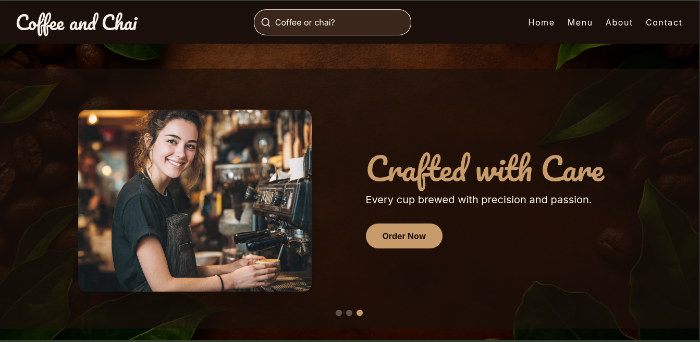

☕ Coffee Shop Website

Visit https://coffeeandchai.netlify.app/

📖 Description

A modern coffee shop website built with React and TailwindCSS. Currently focused on the frontend design and user interface, with backend functionality (such as order management, authentication, and database integration) planned for future implementation.

🚀 Features

Responsive design using TailwindCSS

Interactive UI built with React components

Placeholder for backend integration (Node.js/Express planned)

🛠️ Tech Stack

Frontend: React, TailwindCSS

Backend (planned): Node.js, Express, MongoDB

Version Control: Git & GitHub

⚙️ Setup Instructions

Clone the repository:

git clone https://github.com/Rajx05/Caffeine-Corner.git

Navigate into the project folder:

cd Caffeine-Corner

Install dependencies:

npm install

Start the development server:

npm start

📌 Future Plans

Implement backend with Node.js/Express

Add database support (MongoDB)

Online ordering system

User authentication and profiles

Admin dashboard for managing menu and orders

🤝 Contributing

Pull requests are welcome! For major changes, please open an issue first to discuss what you would like to change.

📜 License

This project is licensed under the MIT License.
